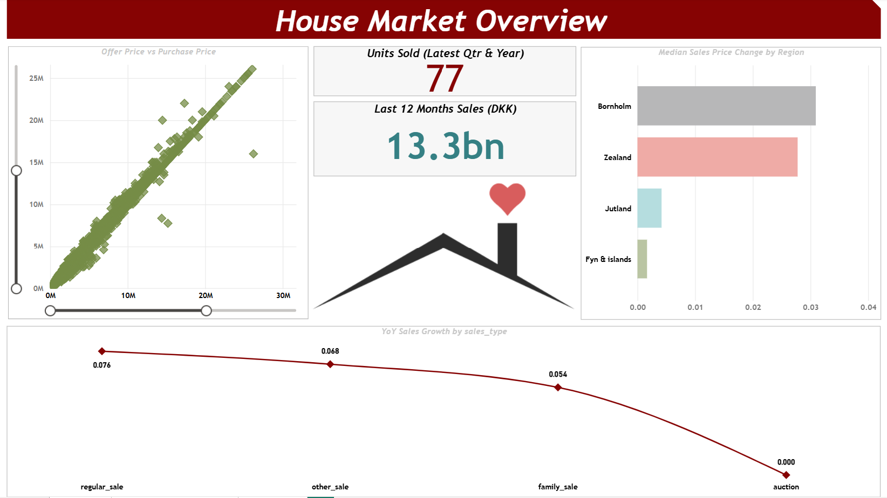
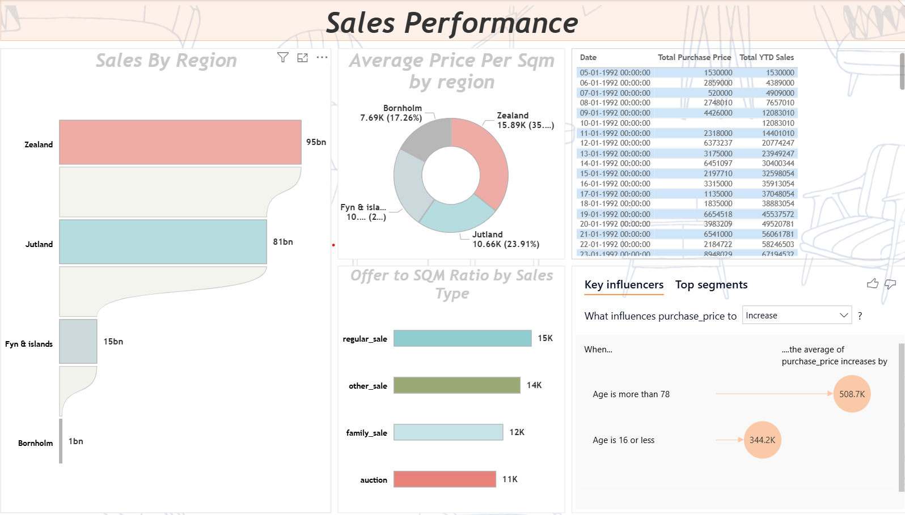
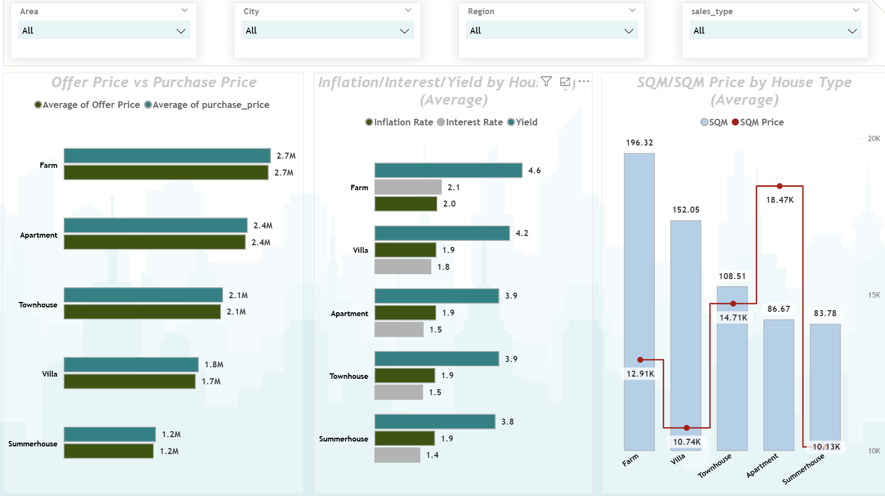

# 🏠 Housing Market Analytics  
### BigQuery Data Warehouse + Power BI Executive Dashboard

---

## 📌 Project Overview

This project analyzes historical residential housing data to uncover:

- Sales performance trends  
- Pricing behavior across property types  
- Regional market dynamics  
- Macroeconomic influence on property values  

The solution follows a structured data architecture:

**Raw Layer → Transformed Layer → Analytical View → Power BI Semantic Model**

Built using:

- **Google BigQuery** (Data Warehouse & SQL transformations)
- **Power BI** (Data modeling, DAX, and dashboard design)

---

## 🎯 Business Problem

Residential property markets are influenced by multiple drivers:

- Property characteristics (size, type)
- Regional demand
- Macroeconomic indicators (inflation, interest rates, yield)
- Offer vs final transaction pricing
- Time-based sales trends

Stakeholders often lack a consolidated analytical view that answers:

- Are property prices increasing year-over-year?
- Which regions generate the highest sales volume?
- How do macroeconomic conditions impact pricing?
- What is the difference between offer and final purchase price?
- Which property types drive revenue?

This dashboard provides a centralized analytical view to support strategic decision-making.

---

## 👥 Intended Audience

- Real estate investors  
- Financial institutions  
- Property development firms  
- Market analysts  
- Real estate boards  
- Data-driven decision makers  

---

## 🏗 Data Architecture

The project follows a layered warehouse approach inside BigQuery:

### 1️⃣ Raw Layer  
`housing_raw`

- Immutable source data
- Direct CSV ingestion
- No business logic applied

### 2️⃣ Transformed Layer  
`housing_transformed`

- Business rules applied
- Data cleaning
- Calculated columns
- Structured for analytics consumption

### 3️⃣ Analytical View  
`region_yearly_summary`

Pre-aggregated reporting layer:

- Units sold
- Total sales
- Average sale price
- Average price per SQM
- Regional yearly breakdown

This structure ensures:

- Clean separation of concerns  
- Maintainable SQL logic  
- BI-ready modeling  

---

## 📊 Dashboard Preview

### 1️⃣ House Market Overview



**Key Highlights:**

- Latest quarter & year units sold
- Last 12 months revenue
- Offer vs Purchase price comparison
- Median sales price change by region
- YoY growth by sales type

---

### 2️⃣ Sales Performance



**Key Highlights:**

- Sales by region
- Average price per SQM
- Offer-to-SQM ratio
- Total Purchase Price vs YTD Sales
- Key Influencers analysis

---

### 3️⃣ Pricing & Market Drivers



**Key Highlights:**

- Offer vs final sale comparison by property type
- Inflation / Interest / Yield analysis
- SQM vs SQM Price breakdown
- Cross-filterable insights by:
  - Area
  - City
  - Region
  - Sales Type

---

## 📈 Key Insights Generated

- Certain regions consistently outperform others in total sales volume.
- Macroeconomic indicators show visible correlation with property pricing trends.
- Offer prices and final purchase prices remain closely aligned in most segments.
- Larger properties do not always imply higher price per SQM.
- Year-over-year growth varies significantly across sales types.

---

## 🧮 Core DAX Measures

Examples of analytical measures implemented:

- **Total YTD Sales**
- **Last 12 Months Sales**
- **YoY Sales Growth**
- **Units Sold**
- **Average Price per SQM**
- **Offer to SQM Ratio**
- Time intelligence using:
  - `CALCULATE`
  - `DATESINPERIOD`
  - `TOTALYTD`

---

## 🗄 SQL Warehouse Script

All warehouse setup logic is available in:
sql/01_housing_warehouse_setup.sql

This script:

- Creates raw table
- Builds transformed table
- Applies business logic
- Creates analytical view layer

---

## 📁 Repository Structure
```
housing-market-analytics-bigquery-powerbi/
│
├── sql/
│ └── 01_housing_warehouse_setup.sql
│
├── screenshots/
│ ├── 01_house-market-overview.png
│ ├── 02_sales-performance-analytics.png
│ └── 03_pricing-and-market-drivers.png
│
├── powerbi/
│ └── denmark_housing_market_dashboard.pbix
│
└── README.md
```

---

## 🛠 Tech Stack

- Google BigQuery
- Standard SQL
- Power BI Desktop
- DAX
- Data Modeling
- GitHub (Version Control)

---

## 🚀 How to Reproduce

1. Upload raw housing CSV into BigQuery
2. Run SQL script in `/sql` folder
3. Connect Power BI to transformed table
4. Refresh semantic model
5. Explore dashboard

---

## 📌 Project Highlights

✔ End-to-end analytics pipeline  
✔ Structured data warehouse approach  
✔ Clean semantic modeling  
✔ Advanced DAX time intelligence  
✔ Executive-level dashboard design  
✔ Business-oriented storytelling  

---

## 📬 Author

**Prajwal Anand**

If you found this project interesting or would like to collaborate, feel free to connect.


